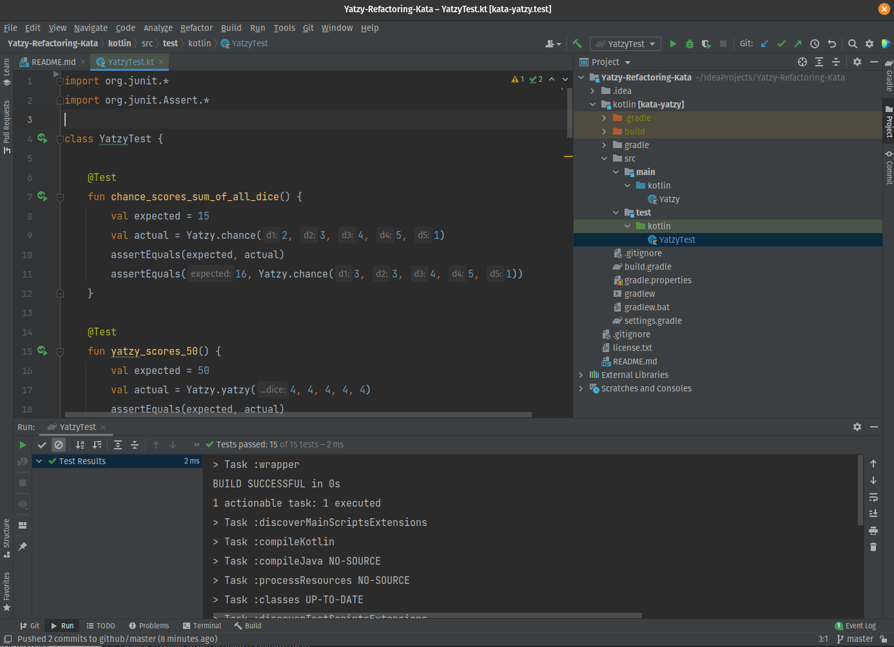

# Yatzy Refactoring Kata

## Origin

This Refactoring Kata was designed by Jon Jagger and is available in his Cyber-Dojo. See
[his blog post](http://jonjagger.blogspot.co.uk/2012/05/yahtzee-cyber-dojo-refactoring-in-java.html)

[@emilybache](https://github.com/emilybache/Yatzy-Refactoring-Kata) have changed it a little, so that the rules more 
closely match the original game.

If you like this Kata, you may be interested in [@emilybache books](https://leanpub.com/u/emilybache) and website
[SammanCoaching.org](https://sammancoaching.org)

## Kata Description

The problem that this code is designed to solve is explained
here: [Yatzy](https://sammancoaching.org/kata_descriptions/yatzy.html)

## Clone or Download this Project from GitHub

See [Cloning a repository](https://help.github.com/en/articles/cloning-a-repository) for details on how to create a
local copy of this project on your computer.

The **master** branch has the starting code.

The **refactor** branch has my attempt of refactoring the Kotlin code.
